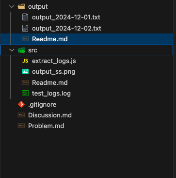
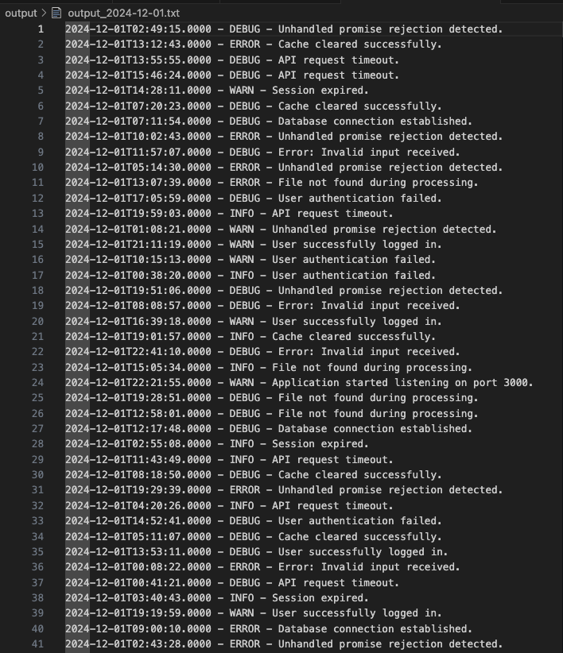

## Solution

**Please review the solution provided in the `src` directory.** The code is designed to efficiently parse log files and extract entries for a specified date using Node.js streams and the `readline` module. Follow the steps outlined in the `DISCUSSION.md` file to run the solution and verify the output.

## Folder Structure


## Output ScreenShot




### 1. Manual Log Parsing

- **Approach:** Manually read the log file and extract entries for the specified date.
- **Pros:** Simple and straightforward.
- **Cons:** Time-consuming and error-prone, especially for large log files.

### 2. Using Regular Expressions

- **Approach:** Use regular expressions to match log entries for the specified date.
- **Pros:** Efficient for pattern matching.
- **Cons:** Complex to implement and maintain, especially for varying log formats.

### 3. Using Node.js Streams and Readline

- **Approach:** Use Node.js streams and the `readline` module to read the log file line by line and extract entries for the specified date.
- **Pros:** Efficient and scalable for large log files. Easy to implement and maintain.
- **Cons:** Requires knowledge of Node.js streams and asynchronous programming.

## Final Solution Summary

I chose the approach of using Node.js streams and the `readline` module to read the log file line by line and extract entries for the specified date. This approach is efficient and scalable for large log files, and it is relatively easy to implement and maintain. By processing the log file line by line, we can handle large files without loading the entire file into memory, which makes the solution more memory-efficient.

## Steps to Run

### 1. Download the Log File

Ensure you have the correct URL to download the log file. Run the following command:

```sh
curl -L -o src/test_logs.log "https://limewire.com/d/0c95044f-d489-4101-bf1a-ca48839eea86#cVKnm0pKXpN6pjsDwav4f5MNssotyy0C8Xvaor1bA5U"

### 2. Navigate to the `src` Directory

Change to the `src` directory where the source code is located:

```sh
cd path/to/your/project/src
```

### 3. Run the Script

Execute the `extract_logs.js` script with the desired date as an argument:

```sh
node extract_logs.js 2024-12-01
```

### 4. Check the Output

The extracted log entries for the specified date will be saved in the `output` directory with the filename `output_2024-12-01.txt`.
